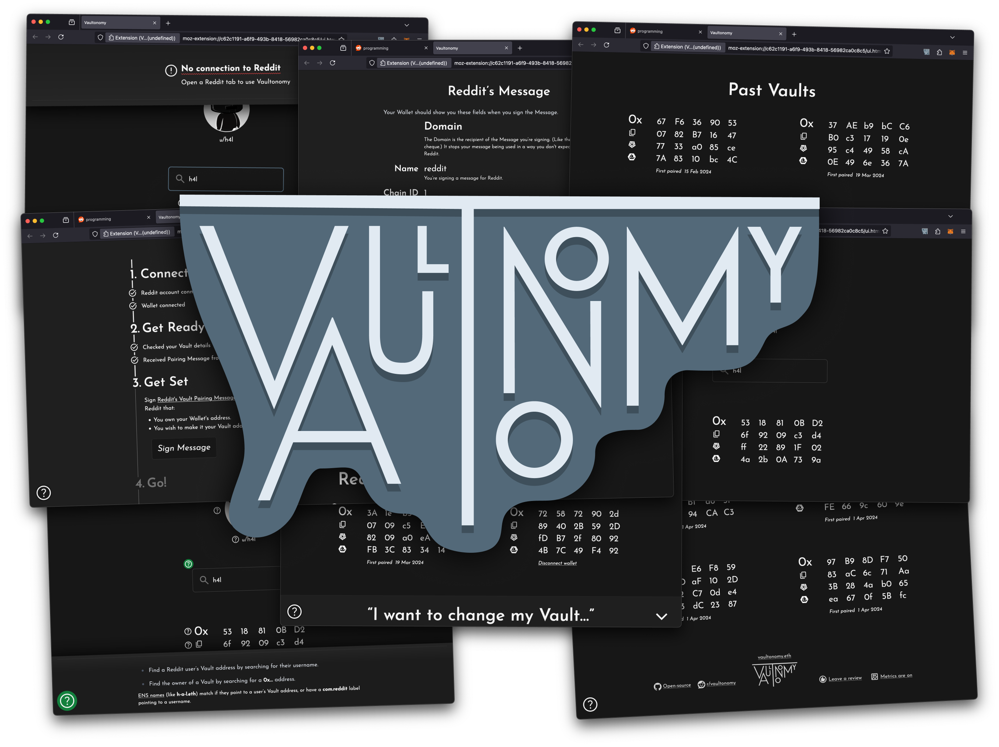
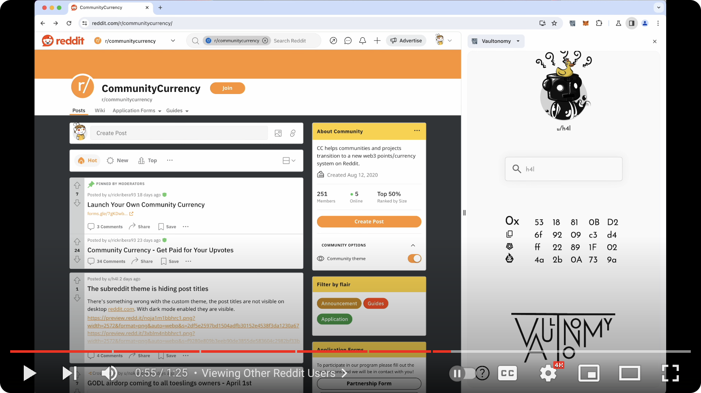

# Vaultonomy

A browser extension for [Reddit Vaults]. Vaultonomy can:

- Pair regular Web3 Wallets as your Reddit account's Vault
- Show your current and past Vaults
- Show the Vault of other Reddit users

[Reddit Vaults]:
  https://support.reddithelp.com/hc/en-us/articles/7558997757332-Reddit-Vault-Basics

Without Vaultonomy, the only way to create a Reddit Vault was to put your seed
phrase into Reddit's mobile app. With Vaultonomy, you can set your Reddit
account's Vault to be your regular Web3 Wallet. This includes hardware wallets —
you can hold your Reddit Avatars and community tokens securely on a hardware
wallet while using them on Reddit.

## Install

**Vaultonomy undergoing pre-release testing.** It is available to install from
the Chrome Web store, and soon Firefox Add-ons. There are likely to be bugs in
this release.

If you'd like to participate in pre-release testing, look for posts from
[u/h4l](https://www.reddit.com/u/h4l) on the
[r/Vaultonomy](https://www.reddit.com/r/Vaultonomy) subreddit.

<dl>
  <dt>Chrome / Edge / Brave / Opera</dt>

  <dd>
  
  </dd>

  <dt>Firefox</dt>

  <dd>

  

  
Vaultonomy is awaiting from approval from Firefox Add-ons — <strong>the listing is not yet public</strong>. In the mean time you can install from the signed <code>.xpi</code> file in the <a href="https://github.com/h4l/vaultonomy/releases">Releases page</a>.
</dd>
</dl>

## Demo Video

A brief screencast demonstrating Vaultonomy:

## Further reading

- [Reviewing Vaultonomy Releases](docs/reviewing-releases.md) — Information for
  people wishing to verify the authenticity of Vaultonomy's releases.
- [Reviewing Vaultonomy Behaviour](docs/reviewing-behaviour.md) — Information
  for people wishing to verify the behaviour of Vaultonomy's code.
